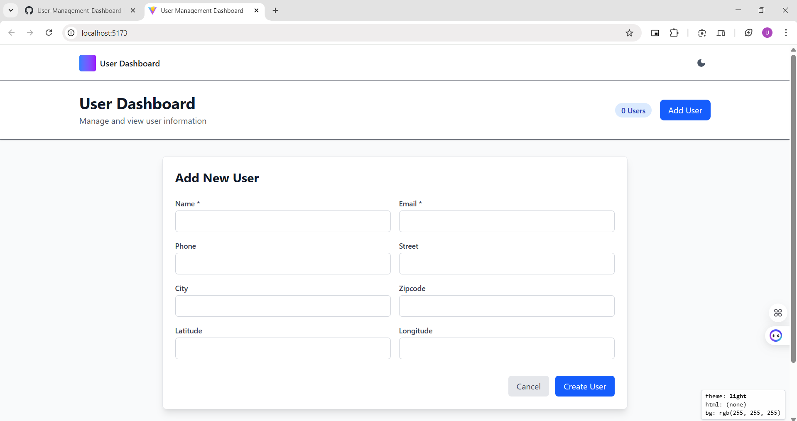
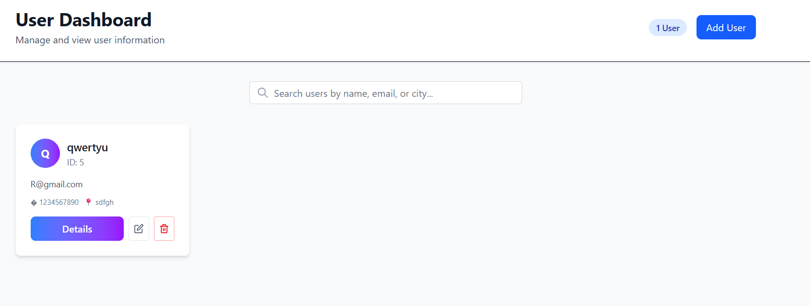
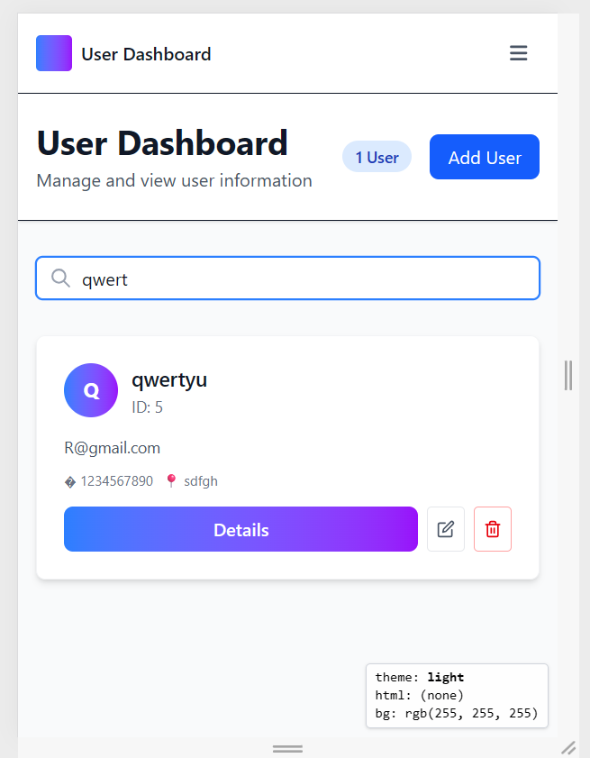

# UserForm Component

The `UserForm` component supports both creating and editing users for the existing backend schema only.

**Backend fields:**
- name
- email
- phone
- street
- city
- zipcode
- geo_lat
- geo_lng
# Deployed App

You can view the deployed app here:
**[https://user-management-dashboard-forty-4.onrender.com/]**

# Forty4 Tech Frontend – User Dashboard

A React + Vite + Tailwind user dashboard consuming the backend User Management API. Implements user listing, detail view, creation form, search filtering, and client-side routing.

## 1. Objective
Build a small dashboard demonstrating React fundamentals: components, hooks, context for shared state, routing, API integration, and basic UI/UX patterns.

## 2. Tech Stack
- React (functional components & hooks)
- React Router DOM
- Context API (light state management)
- Axios (API client)
- Tailwind CSS (utility-first styling)
- Vite (fast dev/build tooling)

## 3. Project Structure (Frontend)
```
frontend/
	src/
		api/
			userService.js
		components/
			Header.jsx
			Footer.jsx
			UserCard.jsx
			UserForm.jsx
		context/
			UserContext.jsx
		pages/
			DashboardPage.jsx
			UserDetailsPage.jsx
		App.jsx
		main.jsx
		index.css
	README.md
	package.json
	tailwind.config.js
	postcss.config.js
```

## 4. Environment Variables
Create a `.env` file (never commit secrets):
```
VITE_API_BASE=http://localhost:3000/api
```
If omitted, the app falls back to `/api` (useful when frontend and backend are served from same origin via reverse proxy). For production deployment (e.g. Netlify/Vercel), set `VITE_API_BASE` to your deployed backend URL.

## 5. Installing & Running
```bash
cd frontend
npm install
npm run dev
```
Open: http://localhost:5173 (default Vite port)

## 6. Available Scripts
| Script        | Purpose                          |
| ------------- | -------------------------------- |
| dev           | Start Vite dev server            |
| build         | Production build (dist output)   |
| preview       | Preview production build         |
| lint          | Run ESLint over source           |

## 7. Core Features Implemented
- Fetch & display user list
- Search by name/email/city (client-side filter)
- Create user via form with inline validation (HTML5 + basic feedback)
- View user detail page (dynamic route `/users/:id`)
- Loading & error states
- Tailwind-based responsive layout

## 8. Global State (Context)
`UserContext` loads users once on mount and exposes: `users`, `loading`, `error`, `refresh`, `setUsers` (for future optimistic updates). Could be extended to include pagination, selection, etc.

## 9. API Service (`userService.js`)
Encapsulates Axios instance with a dynamic base URL:
- Base: `import.meta.env.VITE_API_BASE || '/api'`
- Endpoints: `getUsers`, `getUser`, `createUser`, `updateUser`, `deleteUser`

## 10. Routing
Implemented routes:
| Path          | Component           | Description              |
| ------------- | ------------------- | ------------------------ |
| /             | DashboardPage       | User list + add form     |
| /users/:id    | UserDetailsPage     | Single user details      |

## 11. Styling & Responsiveness
Tailwind utilities used for spacing, layout grids, dark text contrast, subtle gradients for avatars, and responsive card grid (`grid-cols-1 md:grid-cols-2 lg:grid-cols-3 xl:grid-cols-4`).

## 12. Potential Enhancements
- Edit user in place (use PUT route)
- Delete user (button + confirmation modal)
- Toast notifications (success/error)
- Form-level custom validation (e.g., regex phone length, lat/lng range client-side mirroring backend rules)
- Suspense + React Query (replace manual fetching)
- Pagination & server-side filtering
- Testing with Vitest + React Testing Library
- Error boundary & lazy-loaded routes


## 13. Deployment Tips
Netlify / Vercel:
- Set `VITE_API_BASE` environment variable.
- Build command: `npm run build`
- Publish directory: `dist`
If backend is on a different domain, ensure CORS is enabled there.

## 14. Screenshots

### Dashboard Desktop


### User Details


### Mobile View


## 15. License
Add or inherit project license (MIT recommended).

---
This frontend pairs with the backend documented in `../backend/README.md`. Keep commits small and descriptive as you extend functionality.
